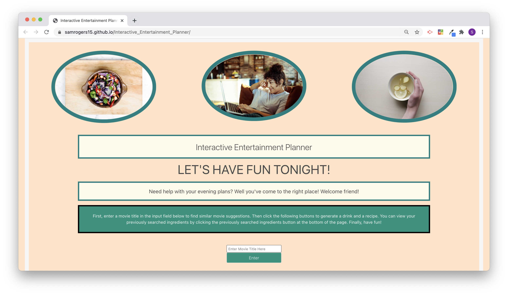

# Interactive Entertainment Planner
> Greetings friends! Let’s set the stage - it’s Friday evening. You’re topping off a LONG week of work. The weather is nasty. You’re completely fried. You just NEED. TO. RELAX. But you can’t muster up the effort to figure out how to unwind.
WORRY NOT! Hop on over to the Interactive Entertainment Planner. With minimal effort, you’ll be able grab a movie recommendation based on a simple input, generate a random cocktail to make for yourself, and find recipes based on ingredients that you want to include.

Movie recommendation? CHECK!

Cocktail in hand? CHECK!

Delicious meal prepared? CHECK!

READY? GET SET? UNWIND!

 
## Table of contents
* [User story](#user-story)
* [General info](#general-info)
* [Screenshots](#screenshots)
* [Technologies](#technologies)
* [Live link](#live-link)
* [Sources](#sources)
* [Contact](#contact)

## User story
As AN INDECISIVE PERSON who needs help curating an evening
I WANT a simple application that can recommend different activities
SO THAT I can try new things and enjoy my evening.

## General info
Our team was motivated by the monotony of quarantine life to create something that aids us in developing an evening to unwind after the sometimes grueling work weeks we’ve experienced. At times, it’s hard to put effort into unwinding after a long week, but it’s extremely important to be able to sit back, relax, and let the stresses of the work week go. Our application creates a one stop shop for a user to plan out an evening with nothing but an idea of a movie in their head and a knowledge of their current pantry stock.

## Screenshots

## Technologies
* HTML
* CSS
* JQuery
* TBD

## Live link
https://samrogers15.github.io/Interactive_Entertainment_Planner/

## Sources
API Sources:
Recipe Puppy: http://www.recipepuppy.com/
The Cocktail DB: https://www.thecocktaildb.com/
Tastedive: https://tastedive.com/

## Contact
Created by:
Tina Armstead
Destiny Fleming
Melissa Stott
Sam Rogers